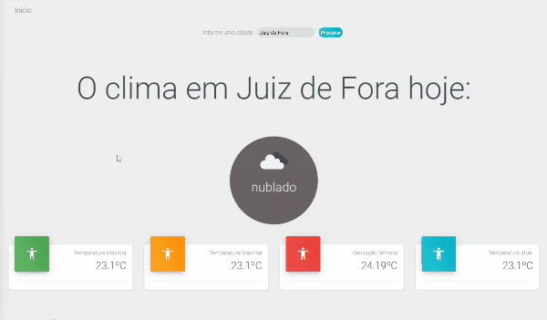

# Wheather

This project is part of the [AppMaster](https://www.linkedin.com/company/appmasters.io/?originalSubdomain=br) mini bootcamp and consists on a website that fetch information from an [API](https://openweathermap.org) and displays it on graphs and tables.

We mainly use [React](https://reactjs.org), to handle the data from the API.

<br />
<p align="center">
    
</p>

# Guide

* [Features](#features)
* [Installation](#installation)
* [Technologies](#technologies)
* [Future Implementations](#future-implementations)


# Features

*  We have a lot of information about Covid 19.

# Installation
`git clone https://github.com/cledman/typescript-minibootcamp`

**You will need install:**

 [Node.js](https://nodejs.org/en/download/) <br />
 [Yarn](https://classic.yarnpkg.com/en/) 

**Install dependencies**

```yarn ```


**Run the application:**

```yarn start```

# Technologies

* [React](https://reactjs.org)
* [TypeScript](https://www.typescriptlang.org/)

# Future Implementations

We could add more dynamic changes and options to select desired information.

Thanks to the guys from  [AppMaster](https://www.linkedin.com/company/appmasters.io/?originalSubdomain=br).
##